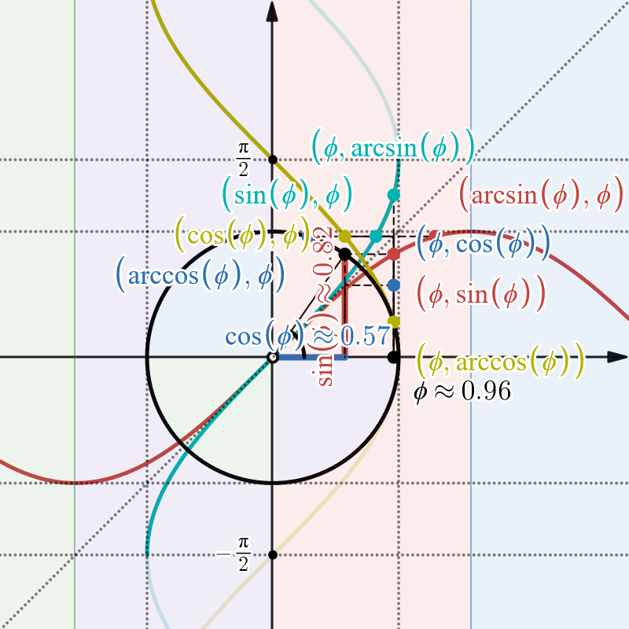
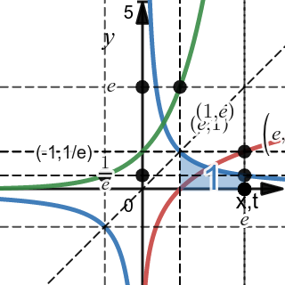
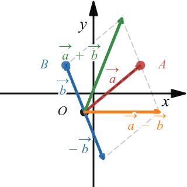
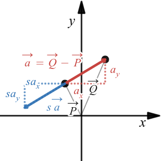
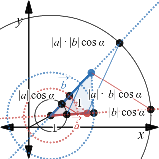
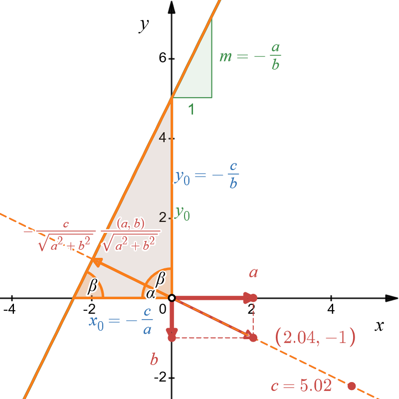
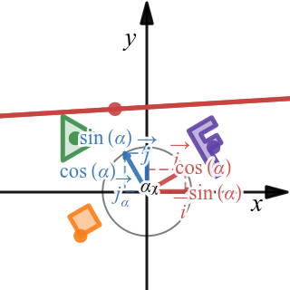
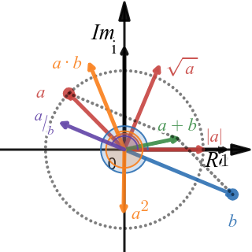
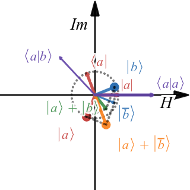

# visumath
A (growing) collection of educational math visualizations in desmos graphing calculator.

Please, **rather bookmark this site than the desmos URLs** since the latter will change on updates!

## Contents

1. [R1](#r1)
  * [Trigonometric functions and the unit circle](#trigonometric-functions-and-the-unit-circle)
  * [Trigonometric function graphs](#trigonometric-function-graphs)
  * [Natural logarithm, Euler number, exponential function](#ln-e-exp)
2. [R2](#r2)
  * [Vector addition](#vector-addition)
  * [Scalar multiplication](#scalar-multiplication)
  * [Inner product](#inner-product)
  * [Line equations](#line-equations)
  * [Rotation](#rotation)
3. [C1](#c1)
  * [Complex number arithmetic](#complex-number-arithmetic)
  * [Complex Hilbert space arithmetic](#complex-hilbert-space-arithmetic)

## R1

### Trigonometric functions and the unit circle
Geometric interpretation of sine, cosine, tangent, cotangent, secant, and cosecant on a circle 
with radius 1.

[https://www.desmos.com/calculator/9njjbkca9z](https://www.desmos.com/calculator/9njjbkca9z)

### Trigonometric function graphs
Real valued trigonometric functions and their derivatives and antiderivatives:
sin, arcsin, cos, arccos, tan, arctan, cot, arccot, sec, arcsec, csc, arccsc

[https://www.desmos.com/calculator/kl5pwzxmmb](https://www.desmos.com/calculator/kl5pwzxmmb)

### ln, e, exp
Natural logarithm, Euler number, and exponential function of real values.

[https://www.desmos.com/calculator/xon16hrqgg](https://www.desmos.com/calculator/xon16hrqgg)

## R2

### Vector addition
Adding and subtracting vectors.

[https://www.desmos.com/calculator/blx95ejvti](https://www.desmos.com/calculator/blx95ejvti)

### Scalar multiplication
Scaling vectors.

[https://www.desmos.com/calculator/dnyvphayhr](https://www.desmos.com/calculator/dnyvphayhr)

### Inner product
Dot product

[https://www.desmos.com/calculator/7kxoinpssq](https://www.desmos.com/calculator/7kxoinpssq)

### Line equations
in standard form and and derivation of parametric, slope-intercept, and Hesse forms.
  
[https://www.desmos.com/calculator/exoierdbbi](https://www.desmos.com/calculator/exoierdbbi)
  

### Rotation
of canonical base vectors, coordinates, and line equations.

[https://www.desmos.com/calculator/qdgc3qfhbv](https://www.desmos.com/calculator/qdgc3qfhbv)

## C1

### Complex number arithmetic

[https://www.desmos.com/calculator/lp3jhertiy](https://www.desmos.com/calculator/lp3jhertiy)

### Complex Hilbert space arithmetic

[https://www.desmos.com/calculator/twnlgtvkeg](https://www.desmos.com/calculator/twnlgtvkeg)

