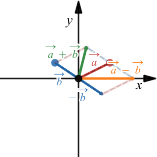

## visumath
Interactive math visualisations with desmos's calculator.

Please, rather bookmark this site than the desmos URLs since the latter will change on updates!

### Adding vectors

[https://www.desmos.com/calculator/2ivnlnvmkp](https://www.desmos.com/calculator/2ivnlnvmkp)

### Line equation
in standard form and how parametric, slope-intercept, and Hesse form get derived from it.
  
[https://www.desmos.com/calculator/dp1erx3rcf](https://www.desmos.com/calculator/dp1erx3rcf)
  

