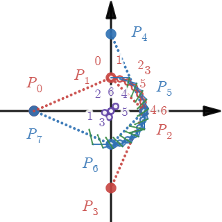

# visumath
A (growing) collection of educational math visualizations in desmos graphing calculator.

Please, **rather bookmark this site than the desmos URLs** since the latter will change on updates!

## Contents

1. [R1](#r1)
  * [Trigonometric functions and the unit circle](#trigonometric-functions-and-the-unit-circle)
  * [Trigonometric function graphs](#trigonometric-function-graphs)
  * [Natural logarithm, Euler number, exponential function](#ln-e-exp)
2. [R2](#r2)
  * [Vector addition](#vector-addition)
  * [Scalar multiplication](#scalar-multiplication)
  * [Inner product](#inner-product)
  * [Line equations](#line-equations)
  * [Rotation](#rotation)
  * [Homogeneous coordinates](#homogeneous-coordinates)
  * [Curvature](#curvature)
  * [Bezier curve](#bezier-curve)
  * [Catmull-Rom spline](#catmull-rom-spline)
  * [Rational Bezier curves](#rational-bezier-curves)
3. [R3](#r3)
  * [Sinoidal wave](#sinoidal-wave)
4. [R4](#r4)
  * [Circular wave](#circular-wave)
  * [Flat wave](#flat-wave)
  * [Polarized wave](#polarized-wave)
5. [C1](#c1)
  * [Complex number arithmetic](#complex-number-arithmetic)
  * [Complex Hilbert space arithmetic](#complex-hilbert-space-arithmetic)

## R1

### Trigonometric functions and the unit circle
Geometric interpretation of sine, cosine, tangent, cotangent, secant, and cosecant on a circle 
with radius 1.

[https://www.desmos.com/calculator/1q3o4wo8ne](https://www.desmos.com/calculator/1q3o4wo8ne)

### Trigonometric function graphs
Real valued trigonometric functions and their derivatives and antiderivatives:
sin, arcsin, cos, arccos, tan, arctan, cot, arccot, sec, arcsec, csc, arccsc

[https://www.desmos.com/calculator/kl5pwzxmmb](https://www.desmos.com/calculator/kl5pwzxmmb)

### ln, e, exp
Natural logarithm, Euler number, and exponential function of real values.

[https://www.desmos.com/calculator/xon16hrqgg](https://www.desmos.com/calculator/xon16hrqgg)

## R2

### Vector addition
Adding and subtracting vectors.

[https://www.desmos.com/calculator/blx95ejvti](https://www.desmos.com/calculator/blx95ejvti)

### Scalar multiplication
Scaling vectors.

[https://www.desmos.com/calculator/dnyvphayhr](https://www.desmos.com/calculator/dnyvphayhr)

### Inner product
Dot product

[https://www.desmos.com/calculator/7kxoinpssq](https://www.desmos.com/calculator/7kxoinpssq)

### Line equations
in standard form and and derivation of parametric, slope-intercept, and Hesse forms.
  
[https://www.desmos.com/calculator/w61bx9rpu2](https://www.desmos.com/calculator/w61bx9rpu2)
  

### Rotation
of canonical base vectors, coordinates, and line equations.

[https://www.desmos.com/calculator/diirwoylqu](https://www.desmos.com/calculator/diirwoylqu)

### Homogeneous coordinates
Transformation to and from homogeneous coordinates, normalization and far points.

[https://www.desmos.com/calculator/padkgx5uhb](https://www.desmos.com/calculator/padkgx5uhb)

### Curvature
Curvature and osculating circle of a continuously differentiable function.

[https://www.desmos.com/calculator/91xdbwxaxv](https://www.desmos.com/calculator/91xdbwxaxv)

### Bezier curve
DeCastelau algorithm, Bernstein form, polynomial form, matrix form, derivatives and curvature of Bezier curves.

[https://www.desmos.com/calculator/hmzaf3gw0b](https://www.desmos.com/calculator/hmzaf3gw0b)

### Catmull-Rom spline
Quarter circle approximation with Catmull-Rom spline and its deviation from ideal circle.

[https://www.desmos.com/calculator/mzzjm4qetr](https://www.desmos.com/calculator/mzzjm4qetr)

### Rational Bezier curves
Half-circle, half-ellipse, parabola and hyperbola branch as rational Bezier curves in homogeneous coordinate matrix form.

[https://www.desmos.com/calculator/bbgxn3kep2](https://www.desmos.com/calculator/bbgxn3kep2)

## R3

### Sinoidal wave
Sinoidal wave in temporal, spatial and spatiotemporal representation

[https://www.desmos.com/calculator/lowmmrrnk2](https://www.desmos.com/calculator/lowmmrrnk2)

## R4

### Circular wave
Sinoidal oscillating membrane in canonical cross section views

[https://www.desmos.com/calculator/piocwdyyo4](https://www.desmos.com/calculator/piocwdyyo4)

### Flat wave
Sinoidal flat wave in canonical cross section views

[https://www.desmos.com/calculator/f1faftq0mt](https://www.desmos.com/calculator/f1faftq0mt)

### Polarized wave
Elliptical, circular and linear polarization of a sinoidal wave in cross section view

[https://www.desmos.com/calculator/tcirqdnyt5](https://www.desmos.com/calculator/tcirqdnyt5)

## C1

### Complex number arithmetic

[https://www.desmos.com/calculator/kizjdicrvg](https://www.desmos.com/calculator/kizjdicrvg)

### Complex Hilbert space arithmetic

[https://www.desmos.com/calculator/twnlgtvkeg](https://www.desmos.com/calculator/twnlgtvkeg)

