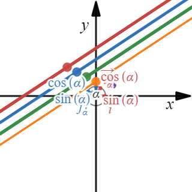
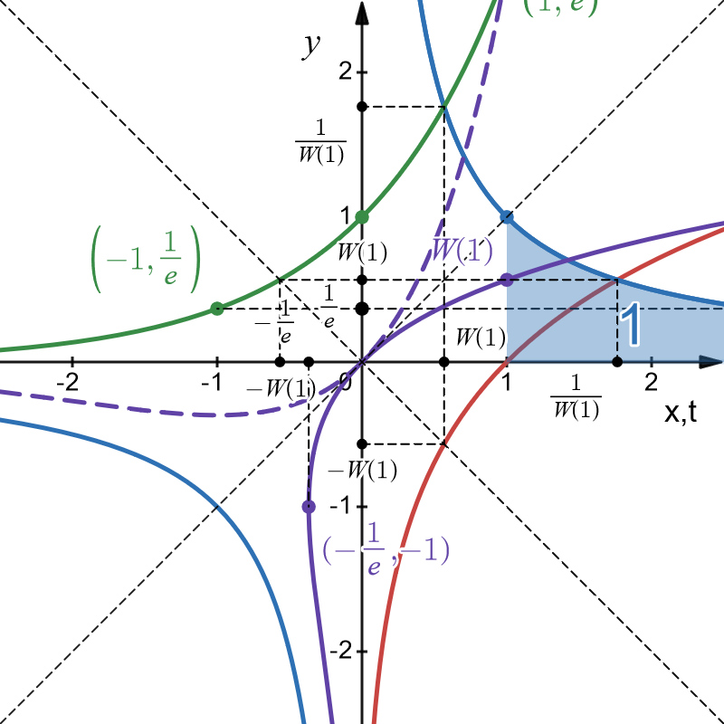

## visumath
A collection of educational math visualizations in desmos graphing calculator.

Please, **rather bookmark this site than the desmos URLs** since the latter will change on updates!

### Vector sum

[https://www.desmos.com/calculator/upihdggdcx](https://www.desmos.com/calculator/upihdggdcx)

### Scalar multiplication

[https://www.desmos.com/calculator/2vkz8blxb0](https://www.desmos.com/calculator/2vkz8blxb0)

### Line equation
in standard form and and derivation of parametric, slope-intercept, and Hesse forms.
  
[https://www.desmos.com/calculator/dp1erx3rcf](https://www.desmos.com/calculator/dp1erx3rcf)
  

### Trigonometric functions

and their derivatives and antiderivatives.

[https://www.desmos.com/calculator/x8e2waa5lh](https://www.desmos.com/calculator/x8e2waa5lh)

### Rotation in two dimensions

2D-Rotation of canonical base vectors, coordinates, and line equations.

[https://www.desmos.com/calculator/jmshkynjo9](https://www.desmos.com/calculator/jmshkynjo9)

### Natural logarithm and exponential function

[https://www.desmos.com/calculator/niqrdjgohy](https://www.desmos.com/calculator/niqrdjgohy)

### Complex number arithmetic

[https://www.desmos.com/calculator/olgfcxbfcv](https://www.desmos.com/calculator/olgfcxbfcv)

