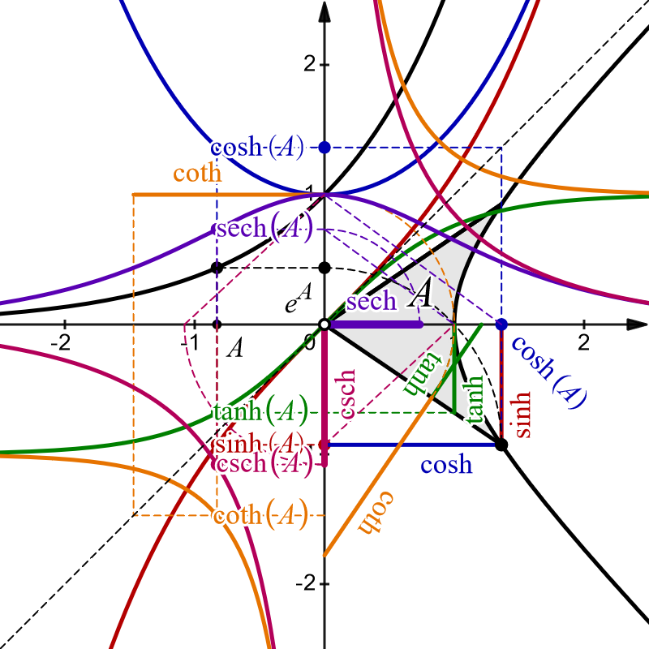
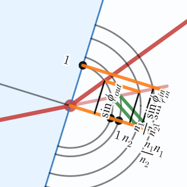
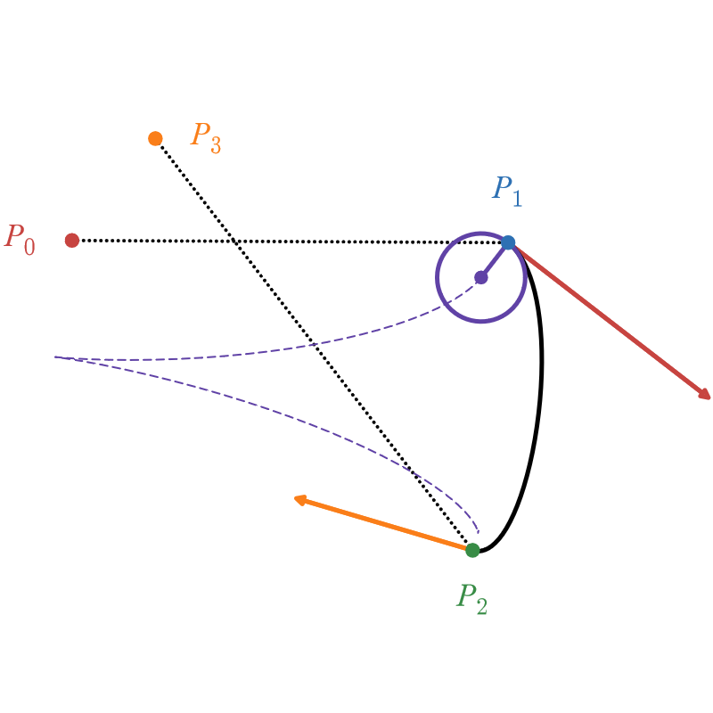
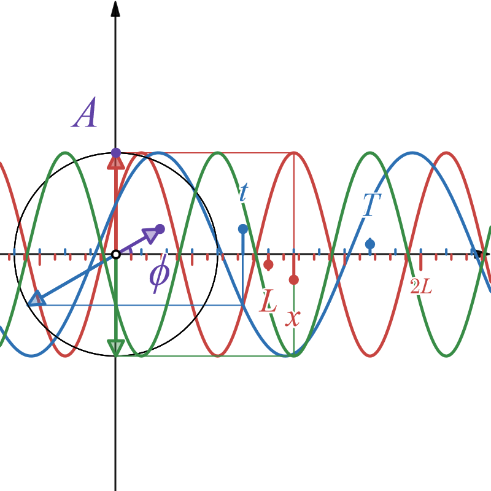
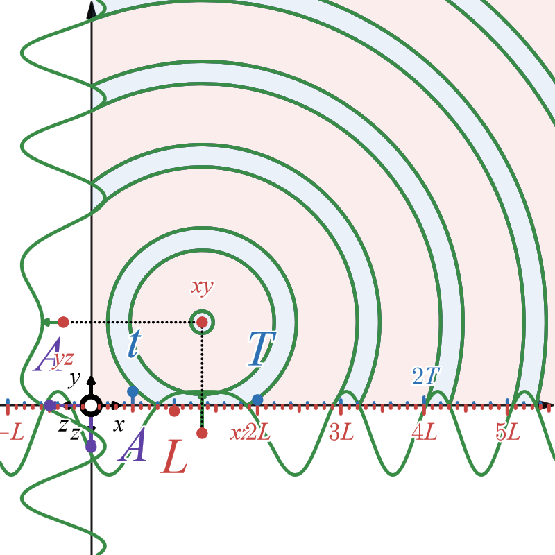
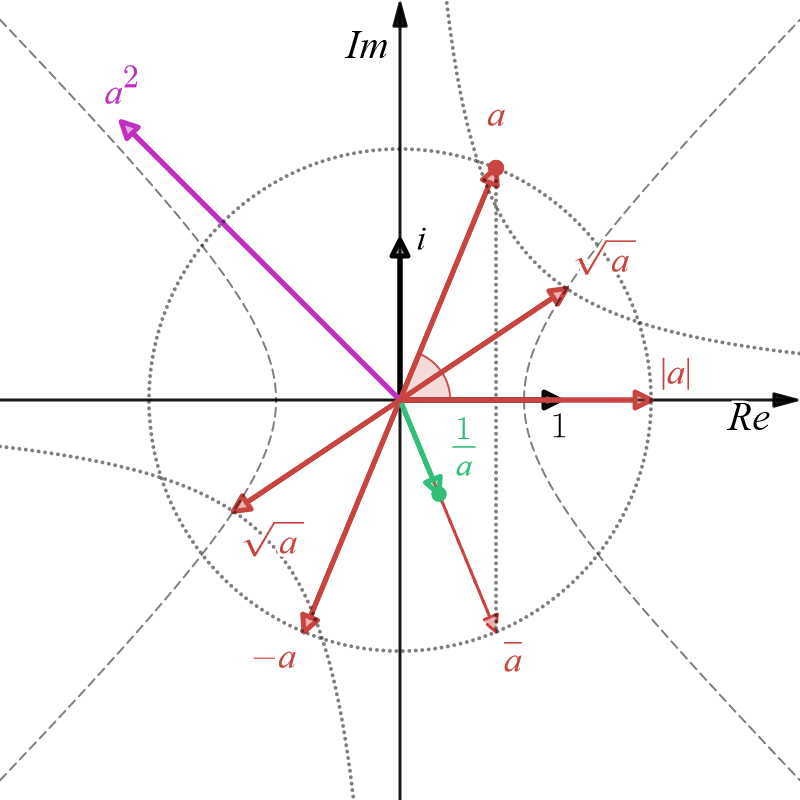

# visumath
A (growing) collection of educational math visualizations in desmos graphing calculator.

Please, **rather bookmark this site than the desmos URLs** since the latter will change on updates!

## Contents

1. [R1](#r1)
  * [Trigonometric functions](#trigonometric-functions)
  * [Hyperbolic functions](#hyperbolic-functions)
  * [Natural logarithm, Euler number, exponential function, Lambert W-function](#ln-e-exp-w)
2. [R2](#r2)
  * [Vector addition](#vector-addition)
  * [Scalar multiplication](#scalar-multiplication)
  * [Inner product](#inner-product)
  * [Homogeneous coordinates](#homogeneous-coordinates)
  * [Line equations](#line-equations)
  * [Rotation](#rotation)
  * [Refraction](#refraction)
  * [Curvature](#curvature)
  * [Bezier curve](#bezier-curve)
  * [Hermite curve](#hermite-curve)
  * [Cardinal curve](#cardinal-curve)
  * [Catmull-Rom curve](#catmull-rom-curve)
  * [Rational Bezier curve](#rational-bezier-curve)
3. [R3](#r3)
  * [Sinoidal wave](#sinoidal-wave)
4. [R4](#r4)
  * [Circular wave](#circular-wave)
  * [Flat wave](#flat-wave)
  * [Polarized wave](#polarized-wave)
5. [C1](#c1)
  * [Complex number arithmetic](#complex-number-arithmetic)
  * [Complex trigonometric functions](#complex-trigonometric-functions)

## R1

### Trigonometric functions
Real valued trigonometric functions, geometric reasoning with 
help of the unit circle, identities, derivatives and antiderivatives:
sin, arcsin, cos, arccos, tan, arctan, cot, arccot, sec, arcsec, csc, arccsc

[https://www.desmos.com/calculator/5dms91pmgz](https://www.desmos.com/calculator/5dms91pmgz)

Angle sum identities:

[https://www.desmos.com/calculator/qs0vt2ojbh](https://www.desmos.com/calculator/qs0vt2ojbh)

Angle difference identities:

[https://www.desmos.com/calculator/plyunzieof](https://www.desmos.com/calculator/plyunzieof)

### Hyperbolic functions
Hyperbolic sine, cosine, tangent and the unit hyperbola.

[https://www.desmos.com/calculator/a6emttcq15](https://www.desmos.com/calculator/a6emttcq15)

### ln, e, exp, W
Natural logarithm, Euler number, exponential function and LambertW-function of real values.

[https://www.desmos.com/calculator/fknzali1gx](https://www.desmos.com/calculator/fknzali1gx)

## R2

### Vector addition
Adding and subtracting vectors.

[https://www.desmos.com/calculator/blx95ejvti](https://www.desmos.com/calculator/blx95ejvti)

### Scalar multiplication
Scaling vectors.

[https://www.desmos.com/calculator/dnyvphayhr](https://www.desmos.com/calculator/dnyvphayhr)

### Inner product
Dot product

[https://www.desmos.com/calculator/7kxoinpssq](https://www.desmos.com/calculator/7kxoinpssq)

### Homogeneous coordinates
Transformation to and from homogeneous coordinates, normalization and far points.

[https://www.desmos.com/calculator/padkgx5uhb](https://www.desmos.com/calculator/padkgx5uhb)

### Line equations
Line equation in standard form and derivation of parametric, slope-intercept, Hesse, polar and homogeneous coordinate forms.
  
[https://www.desmos.com/calculator/si4r5rrtkl](https://www.desmos.com/calculator/si4r5rrtkl)
  

### Rotation
Rotation of canonical base vectors, coordinates, and line equations.

[https://www.desmos.com/calculator/9mxcidhljn](https://www.desmos.com/calculator/9mxcidhljn)

### Refraction
Refraction and inner reflection of a ray of light at a plane surface between two homogeneous media.

[https://www.desmos.com/calculator/gasu2wvno7](https://www.desmos.com/calculator/gasu2wvno7)

### Curvature
Curvature and osculating circle of a continuously differentiable function.

[https://www.desmos.com/calculator/91xdbwxaxv](https://www.desmos.com/calculator/91xdbwxaxv)

### Bezier curve
De Castelau algorithm, Bernstein form, polynomial form, matrix form, derivatives and curvature of Bezier curves.

[https://www.desmos.com/calculator/5mxwdei16h](https://www.desmos.com/calculator/5mxwdei16h)

### Hermite curve
Polynomial and matrix form, derivatives, curvature, osculating circle, quarter circle approximation.

[https://www.desmos.com/calculator/ln1exvl9il](https://www.desmos.com/calculator/ln1exvl9il)

### Cardinal curve
Polynomial and matrix form, derivatives, curvature, osculating circle, quarter circle approximation.

[https://www.desmos.com/calculator/06mclwqqur](https://www.desmos.com/calculator/06mclwqqur)

### Catmull-Rom curve
Polynomial and matrix form, derivatives, curvature, osculating circle, quarter circle approximation.
(Cardinal curve with tension 0.5)

[https://www.desmos.com/calculator/z9slwnkvle](https://www.desmos.com/calculator/z9slwnkvle)

### Rational Bezier curve
Circle, ellipse, parabola and hyperbola as rational Bezier curves in homogeneous coordinate matrix form.

[https://www.desmos.com/calculator/j3bnviwjqv](https://www.desmos.com/calculator/j3bnviwjqv)

## R3

### Sinoidal wave
Sinoidal wave in temporal, spatial and spatiotemporal representation

[https://www.desmos.com/calculator/lowmmrrnk2](https://www.desmos.com/calculator/lowmmrrnk2)

## R4

### Circular wave
Sinoidal oscillating membrane in canonical cross section views

[https://www.desmos.com/calculator/piocwdyyo4](https://www.desmos.com/calculator/piocwdyyo4)

### Flat wave
Sinoidal flat wave in canonical cross section views

[https://www.desmos.com/calculator/f1faftq0mt](https://www.desmos.com/calculator/f1faftq0mt)

### Polarized wave
Elliptical, circular and linear polarization of a sinoidal wave in cross section view

[https://www.desmos.com/calculator/tcirqdnyt5](https://www.desmos.com/calculator/tcirqdnyt5)

## C1

### Complex number arithmetic

[https://www.desmos.com/calculator/kizjdicrvg](https://www.desmos.com/calculator/kizjdicrvg)

### Complex trigonometric functions

Trigonometric functions of complex values in the complex number plane:
Sine, cosine, tangent, cotangent, secant, cosecant.
Application to parametric line (grid), circle, and square.

[https://www.desmos.com/calculator/kgsjcy7auy](https://www.desmos.com/calculator/kgsjcy7auy)

